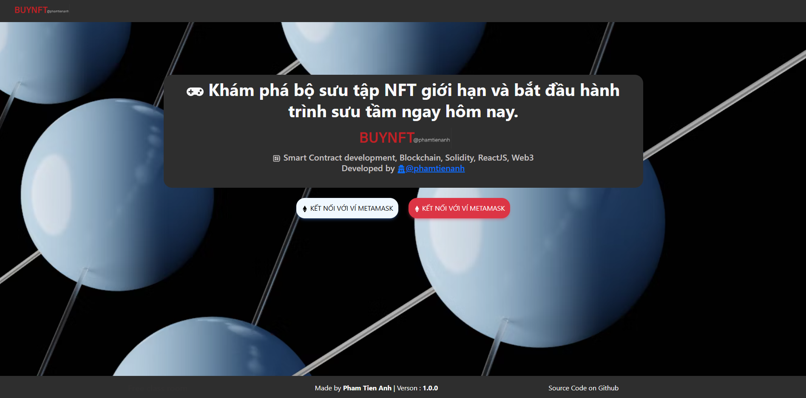
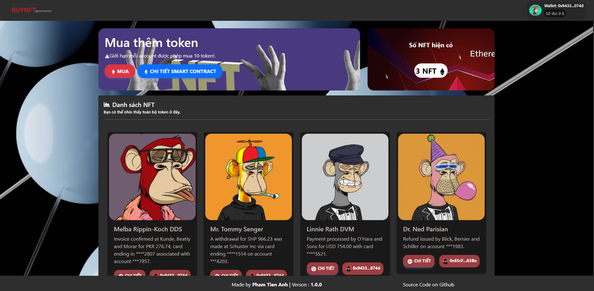
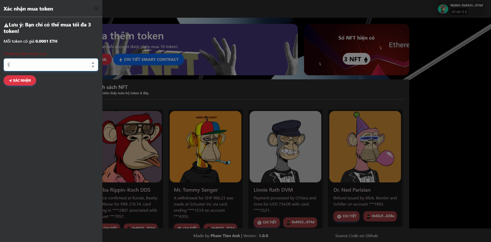

# 3️⃣ NFT Whitelist Sale - Capstone Project AC-Blockchain

<p align="center">
  
  
  
  
  
</p>


## Project Description

This is a web application project that allows users to purchase NFTs through a Whitelist Sale mechanism. The project includes an ERC721 smart contract and a ReactJS frontend for interacting with the contract.

### Main Features

- **ERC721 Smart Contract**: 
  - Implements the ERC721 standard for creating and managing unique NFTs.
  - Only addresses added to the whitelist by the owner can mint NFTs.
  - Limits the maximum number of NFTs each wallet can own.
  - The owner (admin) can withdraw all ETH collected from NFT sales.

- **Frontend ReactJS**:
  - Connects to MetaMask and checks for the Sepolia network.
  - Displays the number of minted NFTs, NFT list, and detailed information for each NFT.
  - Minting function is only available for whitelisted addresses.
  - Shows wallet balance and transaction status notifications.

## Folder Structure

```
contract/
  ac-hardhat-template/
    contracts/           # Solidity smart contracts (ERC721, whitelist logic, etc.)
    deploy/              # Deployment scripts for smart contracts
    scripts/             # Custom scripts (e.g., for minting, adding to whitelist)
    test/                # Smart contract tests
    artifacts/           # Compiled contract artifacts (auto-generated)
    typechain/           # TypeScript typings for contracts (auto-generated)
    hardhat.config.ts    # Hardhat configuration
    package.json         # Node.js dependencies for smart contract development

web/
  public/                # Static assets (index.html, images, manifest, etc.)
  src/
    assets/              # Images, icons, and other static resources
    components/          # Reusable React components (UI, NFT cards, modals, etc.)
    config/              # Contract address, ABI, and configuration files
    context/             # React context (e.g., authentication, wallet)
    pages/               # Main pages (Home, Profile, etc.)
    service/             # Service files for interacting with the smart contract
    App.js               # Main React app entry point
    index.js             # ReactDOM render entry
  package.json           # Node.js dependencies for frontend
  README.md              # Frontend usage and documentation

README.md                # Project overview and instructions (this file)
```

## Getting Started

You have two ways to access and use the application:

### 1. Run Locally

#### a. Install dependencies

```sh
# Install smart contract dependencies
cd contract/ac-hardhat-template
npm install

# Install frontend dependencies
cd ../../web
npm install
```

#### b. Deploy the smart contract

Make sure you have set up your `.env` file with your PRIVATE_KEY and RPC_URL before deploying.

```sh
cd contract/ac-hardhat-template
npx hardhat run --network sepolia deploy/deploy.js
```

#### c. Start the frontend application

```sh
cd web
npm start
```

Visit [http://localhost:3000](http://localhost:3000) in your browser.

---

### 2. Access the Deployed Website

You can directly use the deployed version of the application at:  
[https://capstone-project-tieanh19.vercel.app/#](https://capstone-project-tieanh19.vercel.app/#)

---

## Screenshots

### Home Page


### Profile Page and Owned NFT List


### Mint NFT Page (Whitelist Only)


### NFT Token Detail Page


*You can replace the above images with your actual screenshots, saved in the `screenshots` folder in your project.*

---

## Smart Contract

- ERC721 standard.
- `addToWhitelist(address)` function can only be called by the owner.
- `mint(uint256 amount)` function is only available for whitelisted addresses and checks the per-wallet limit.
- `withdraw()` function allows the owner to withdraw ETH to the admin wallet.

## Technologies Used

- ReactJS, Bootstrap, React-Bootstrap, Ethers.js, Redux, React-Router, React-Toastify.
- Solidity smart contract (deployed on Sepolia).