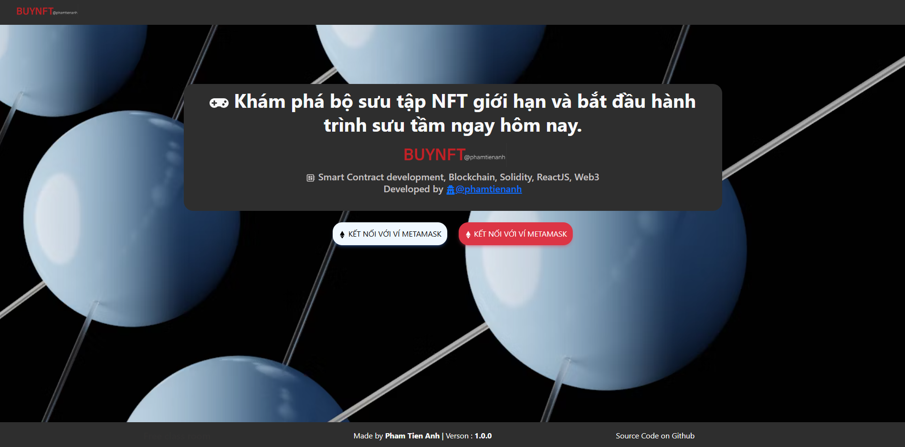
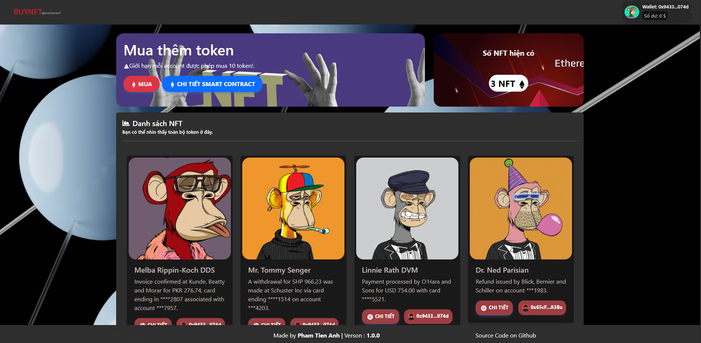
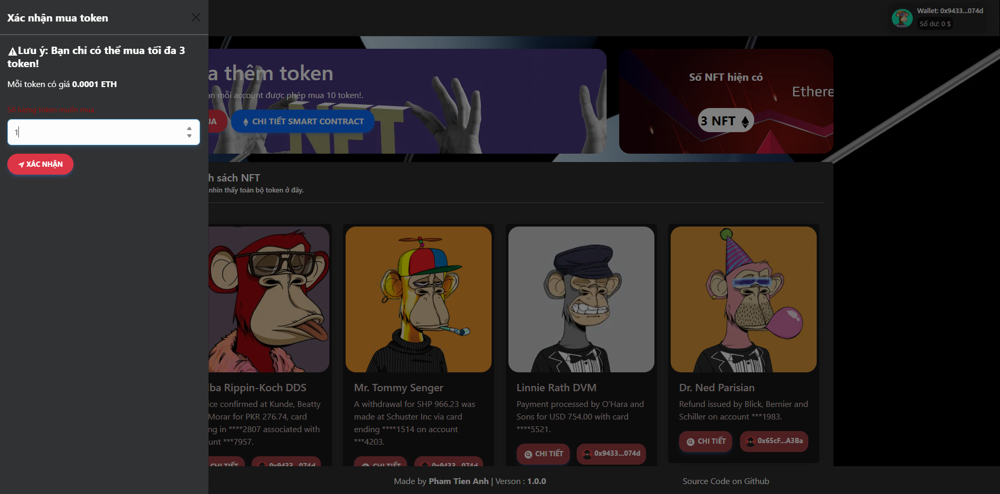

# 3️⃣ NFT Whitelist Sale

## Mô tả dự án

Đây là dự án ứng dụng web cho phép người dùng tham gia mua NFT thông qua hình thức Whitelist Sale. Dự án bao gồm một smart contract ERC721 và một giao diện ReactJS để tương tác với contract.

### Tính năng chính

- **Smart Contract ERC721**: 
  - Chuẩn ERC721 cho phép phát hành và quản lý các NFT duy nhất.
  - Chỉ các địa chỉ được owner thêm vào whitelist mới có quyền mint NFT.
  - Giới hạn số lượng NFT tối đa mà mỗi ví có thể sở hữu.
  - Chủ sở hữu (admin) có thể rút toàn bộ số ETH thu được từ việc bán NFT về ví của mình.

- **Frontend ReactJS**:
  - Kết nối ví MetaMask, kiểm tra mạng Sepolia.
  - Hiển thị số lượng NFT đã mint, danh sách NFT, thông tin chi tiết từng NFT.
  - Chức năng mint NFT chỉ dành cho whitelist.
  - Hiển thị số dư ví, thông báo trạng thái giao dịch.

## Cấu trúc thư mục

- `src/config/contract.jsx`: Chứa địa chỉ contract, ABI, các tham số cấu hình và mã lỗi.
- `src/service/callContract.service.js`: Giao tiếp với smart contract (mint, lấy thông tin NFT, kiểm tra whitelist...).
- `src/components/ProfilePage/`: Các thành phần giao diện liên quan đến NFT, ví, banner mint...
- `src/pages/Home/`, `src/pages/Profile/`: Trang chính và trang profile người dùng.

## Hướng dẫn sử dụng

1. **Cài đặt**  
   ```sh
   npm install
   ```

2. **Chạy ứng dụng**  
   ```sh
   npm start
   ```
   Truy cập [http://localhost:3000](http://localhost:3000)

3. **Kết nối ví & mint NFT**
   - Kết nối MetaMask, chuyển sang mạng Sepolia.
   - Nếu địa chỉ của bạn đã được owner thêm vào whitelist, bạn có thể mint NFT (tối đa số lượng cho phép).
   - Sau khi mint, NFT sẽ hiển thị trong trang profile.

---

## Ảnh giao diện

### Giao diện trang chủ


### Giao diện profile và danh sách NFT đã sở hữu


### Giao diện mint NFT (chỉ whitelist)


### Giao diện chi tiết NFT token


*Bạn có thể thay thế các ảnh trên bằng ảnh chụp màn hình thực tế của bạn, lưu vào thư mục `screenshots` trong project.*

---


## Smart Contract

- Chuẩn ERC721.
- Hàm `addToWhitelist(address)` chỉ owner gọi được.
- Hàm `mint(uint256 amount)` chỉ cho phép whitelist, kiểm tra giới hạn mỗi ví.
- Hàm `withdraw()` cho phép owner rút ETH về ví admin.

## Công nghệ sử dụng

- ReactJS, Bootstrap, React-Bootstrap, Ethers.js, Redux, React-Router, React-Toastify.
- Smart contract Solidity (triển khai trên Sepolia).

---